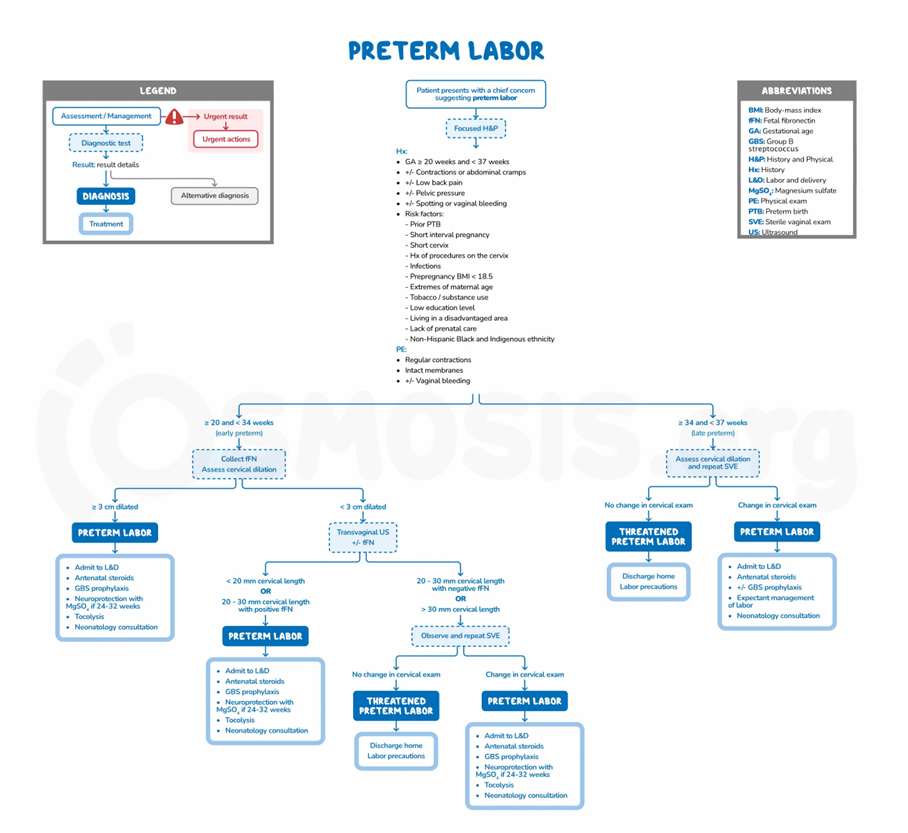

  <table style="width: 100%; border: none; border-collapse: collapse;">
    <tr style="border: none;">
      <td style="border: none; padding: 0;">
        <h1 style="margin-top: 0; color: #3b82f6;">Sathasivam Durga</h1>
        <h4 style="margin-top: 10px; margin-bottom: 10px; color: #334155; font-weight: normal;">
          <strong>Electrical & Electronic Engineering Undergraduate </strong> 
        </h4>
        

          University of Peradeniya | Kandy, Sri Lanka
        

        

          <a href="https://www.linkedin.com/in/sathasivam-durga-821908315" style="text-decoration: none; background: #e0e7ff; color: #1d4ed8; padding: 4px 10px; border-radius: 6px; font-weight: bold; margin-right: 8px;">🔗 LinkedIn</a>
          <a href="mailto:e21120@eng.pdn.ac.lk" style="text-decoration: none; background: #e0e7ff; color: #1d4ed8; padding: 4px 10px; border-radius: 6px; font-weight: bold; margin-right: 8px;">✉️ Email </a>
          <a href="https://docs.google.com/document/d/15Rh5QakTWT68dJ6UjYreFPV0I2_ROaJRvMWKX8m49ho/edit?usp=sharing" style="text-decoration: none; background: #e0e7ff; color: #1d4ed8; padding: 4px 10px; border-radius: 6px; font-weight: bold;">📄 Resume</a>
        

      </td>
      <td width="240" align="right" valign="top" style="border: none; padding: 0;">
        

          
        

      </td>
    </tr>
  </table>

  <h2 style="color: #1e3a8a; border-bottom: 2px solid #bfdbfe; padding-bottom: 10px; margin-top: 0;"> About Me</h2>
  
I am a third-year engineering student specializing in digital signal processing (DSP) and machine learning. My academic focus and current research revolve around biomedical engineering—specifically, analyzing complex physiological data to build robust clinical prediction models. I am passionate about extracting meaningful features from noisy, real-world data and applying advanced algorithms to solve critical healthcare challenges.

  <h2 style="color: #1e3a8a; border-bottom: 2px solid #bfdbfe; padding-bottom: 10px; margin-top: 0;">Technical Toolkit</h2>
  <ul style="color: #334155; line-height: 1.8; list-style-type: none; padding-left: 0;">
    <li><strong style="color: #2563eb;">Programming Languages:</strong> Python, MATLAB, C</li>
    <li><strong style="color: #2563eb;">Data Science & ML:</strong> scikit-learn, NumPy, SciPy, Predictive Modeling</li>
    <li><strong style="color: #2563eb;">Signal Processing:</strong> Digital Filtering, FourierTransforms, Feature Extraction</li>
    <li><strong style="color: #2563eb;">Tools & Environments:</strong> Google Colab, Git, LaTeX, Overleaf</li>
  </ul>

  <h2 style="color: #1e3a8a; border-bottom: 2px solid #bfdbfe; padding-bottom: 10px; margin-top: 0;"> Project Overview: Preterm Birth Prediction</h2>

  

    <h4 style="margin-top: 0; margin-bottom: 8px; color: #1d4ed8;"> The Clinical Challenge</h4>
    
Preterm birth remains a primary cause of neonatal mortality worldwide. Early detection of preterm labor risks is critical to providing timely clinical interventions. Traditional diagnostic methods often lack the sensitivity required to detect early uterine remodeling before active labor begins.

  

  <h3 style="color: #1e3a8a; margin-top: 0; margin-bottom: 15px;"> Our Approach</h3>
  
This undergraduate research project focuses on developing a non-invasive, objective clinical prediction framework using advanced data analysis. By analyzing physiological parameters across multi-channel electrical recordings, the project leverages two primary modalities:

  

    

      

      <h4 style="color: #2563eb; margin-top: 0; margin-bottom: 10px; font-size: 1.1em;">Uterine Electromyography (EHG)</h4>
      
Capturing the raw electrical activity of the uterine smooth muscle via abdominal electrodes.

    

    

      

      <h4 style="color: #2563eb; margin-top: 0; margin-bottom: 10px; font-size: 1.1em;">Tocodynamometry (TOCO)</h4>
      
Monitoring the mechanical pressure changes associated with uterine contractions.

    

  

  <h3 style="color: #1e3a8a; margin-top: 0; margin-bottom: 15px;"> Methodology Pipeline</h3>
  
The core of our research follows a rigorous four-stage engineering pipeline:

  

    

      
Stage 01

      <h4 style="margin: 0 0 10px 0; color: #1e3a8a; font-size: 1.05em;">Data Prep</h4>
      
Cleaning raw clinical datasets by removing motion artifacts and baseline wander.

    

    

      
Stage 02

      <h4 style="margin: 0 0 10px 0; color: #1e3a8a; font-size: 1.05em;">DSP Filtering</h4>
      
Applying bandpass filtering and time-frequency analysis to isolate signals.

    

    
 

      
Stage 03

      <h4 style="margin: 0 0 10px 0; color: #1e3a8a; font-size: 1.05em;">Extraction</h4>
      
Capturing statistical, frequency, and non-linear signal characteristics.

    

    
 

      
Stage 04

      <h4 style="margin: 0 0 10px 0; color: #1e3a8a; font-size: 1.05em;">ML Models</h4>
      
Training predictive algorithms to classify and benchmark Term vs Preterm.

    

  

  
  

  <h2 style="color: #1e3a8a; border-bottom: 2px solid #bfdbfe; padding-bottom: 10px; margin-top: 0;"> Supervisors</h2>
  
  

    

      <strong style="color: #1d4ed8;">Main Supervisor:</strong> Prof. Roshan Godaliyadda
    

    

      <strong style="color: #1d4ed8;">Co-Supervisors:</strong>
    

    <ul style="color: #475569; margin-top: 0; margin-bottom: 0; line-height: 1.6;">
      <li>Prof. Parakrama Ekanayake</li>
      <li>Dr. Ruwan Ranaweera</li>
      <li>Prof. Chathura Ratnayake</li>
    </ul>
    

  

  <h2 style="color: #1e3a8a; border-bottom: 2px solid #bfdbfe; padding-bottom: 10px; margin-top: 0;"> 14-Week Progress Timeline</h2>
  
Welcome to my project documentation. Click on any week below to expand and view detailed progress logs, research notes, and references directly on this page.

  <h3 style="color: #1d4ed8; margin-top: 30px; margin-bottom: 15px; border-left: 4px solid #3b82f6; padding-left: 10px;">Phase 1: Literature & Data Acquisition</h3>
  
 

    

      Week 01: Clinical Background & Foundations
       Click to Expand
    

    

      
 April 27, 2026 - May 2, 2026

      
  <h4 style="color: #1d4ed8; margin-top: 0;"> Tasks & Accomplishments</h4>
      
This week focused on establishing the foundational biological and clinical knowledge required for preterm birth prediction, ensuring our engineering models are grounded in real medical realities:

      <ul style="color: #475569; line-height: 1.7;">
        <li><strong>Biological Background:</strong> Defined the physiological differences between term and preterm birth, specifically mapping out the significant factors and clinical risk indicators that contribute to early uterine contractions during gestation.</li>
        <li><strong>Clinical Impact Analysis:</strong> Investigated the severe neonatal effects of unpredicted preterm birth, particularly focusing on neurological vulnerabilities, brain development disruption, and long-term learning difficulties.</li>
        <li><strong>Importance of Early Detection:</strong> Established the medical necessity of our predictive engineering models. Early detection provides a critical time window for clinicians to administer preventative medications (such as corticosteroids for fetal lung development) which dramatically improve infant survival rates.</li>
      </ul>

   

        
        
<em>Visual map of preterm birth risk factors and clinical concepts.</em>

      

  <h4 style="color: #1d4ed8; margin-top: 25px;"> Papers & Referenced Resources</h4>
      

        <a href="https://www.who.int/news-room/fact-sheets/detail/preterm-birth?utm_" target="_blank" style="text-decoration: none; border: 1px solid #e2e8f0; border-radius: 6px; padding: 10px; background: white; display: flex; align-items: center; gap: 10px;">
          
          
<h5 style="margin:0; color: #1e3a8a; font-size:0.85em;">WHO Fact Sheet</h5>
Global Data

        </a>
        <a href="https://obgyn.onlinelibrary.wiley.com/doi/epdf/10.1046/j.1471-0528.2003.00012.x" target="_blank" style="text-decoration: none; border: 1px solid #e2e8f0; border-radius: 6px; padding: 10px; background: white; display: flex; align-items: center; gap: 10px;">
          
          
<h5 style="margin:0; color: #1e3a8a; font-size:0.85em;">Epidemiology & Causes</h5>
Wiley Library

        </a>
        <a href="https://www.osmosis.org/learn/Preterm_labor:_Clinical_sciences" target="_blank" style="text-decoration: none; border: 1px solid #e2e8f0; border-radius: 6px; padding: 10px; background: white; display: flex; align-items: center; gap: 10px;">
          
          
<h5 style="margin:0; color: #1e3a8a; font-size:0.85em;">Clinical Sciences</h5>
Osmosis Learning

        </a>
        <a href="https://youtu.be/xM20pkEDhhA?si=GHGujoFyBNxBM3M" target="_blank" style="text-decoration: none; border: 1px solid #e2e8f0; border-radius: 6px; padding: 10px; background: white; display: flex; align-items: center; gap: 10px;">
          
          
<h5 style="margin:0; color: #1e3a8a; font-size:0.85em;">Infant Brain Dev</h5>
Brigham Hospital

        </a>
      

    

  

  

    

      Week 02: Analyzing Existing Prediction Methods
       Click to Expand
    

  

      
 May 3, 2026 - May 10, 2026

      <h4 style="color: #1d4ed8; margin-top: 0;"> Tasks & Accomplishments</h4>
      
This week focused on evaluating current practical and experimental approaches to preterm birth prediction and prevention in modern obstetrics:

      
  <ul style="color: #475569; line-height: 1.7;">
        <li><strong>Clinical Risk Assessment:</strong> Evaluated standard diagnostic tools including the Bishop Score (assessing cervical dilation, effacement, consistency, position, and fetal station), transvaginal cervical length ultrasound, and fetal fibronectin (fFN) testing for early detection.</li>
        <li><strong>Emerging Therapeutics & Devices:</strong> Investigated the physiological role of melatonin in stimulating nighttime uterine contractions. Reviewed the novel development of a blue LED light-emitting eye mask designed to suppress maternal melatonin production non-invasively to delay premature labor.</li>
        <li><strong>Technological Interventions:</strong> Mapped the broader landscape of modern preventative methods, including biomarker-based tests, AI-assisted prediction models, progesterone therapy, and cervical cerclage.</li>
      </ul>

   <h4 style="color: #1d4ed8; margin-top: 25px;"> Papers & Referenced Resources</h4>
      

        
 <a href="https://journals.sagepub.com/doi/10.2217/whe.15.74" target="_blank" style="text-decoration: none; border: 1px solid #e2e8f0; border-radius: 6px; padding: 10px; background: white; display: flex; align-items: center; gap: 10px; transition: all 0.2s ease; box-shadow: 0 2px 4px rgba(0,0,0,0.02);">
          
          

            <h5 style="margin:0; color: #1e3a8a; font-size:0.85em;">Preterm Labor & Melatonin</h5>
            
SagePub Journal

          

        </a>

 <a href="https://arxiv.org/pdf/2602.24139" target="_blank" style="text-decoration: none; border: 1px solid #e2e8f0; border-radius: 6px; padding: 10px; background: white; display: flex; align-items: center; gap: 10px; transition: all 0.2s ease; box-shadow: 0 2px 4px rgba(0,0,0,0.02);">
          
          

            <h5 style="margin:0; color: #1e3a8a; font-size:0.85em;">AI-Assisted Prediction Models</h5>
            
ArXiv Research Repository

          

        </a>

   <a href="https://www.youtube.com/watch?v=1_mqL6qpdVg" target="_blank" style="text-decoration: none; border: 1px solid #e2e8f0; border-radius: 6px; padding: 10px; background: white; display: flex; align-items: center; gap: 10px; transition: all 0.2s ease; box-shadow: 0 2px 4px rgba(0,0,0,0.02);">
          
          

            <h5 style="margin:0; color: #1e3a8a; font-size:0.85em;">Targeting Preterm Labor</h5>
            
FSU Device Prototype

          

        </a>

   

  

  

  
  

    

      Week 03: Exploring Publicly Available Datasets
       Click to Expand
    

  
   

      
 May 11, 2026 - May17, 2026

      
  <h4 style="color: #1d4ed8; margin-top: 0;"> Tasks & Accomplishments</h4>
      
This week transitioned into data acquisition, evaluating the worldwide datasets available for tocogram (TOCO) and Electrohysterogram (EHG) signals. These signals observe uterine electrical activity and require precise processing for subsequent Machine Learning classification.

      
<h5 style="color: #1e3a8a; margin-bottom: 8px; font-size: 1em;">The 3 Major Open EHG Datasets:</h5>
      <ul style="color: #475569; line-height: 1.7;">
        <li><strong style="color: #2563eb;">TPEHG DB:</strong> ~300 recordings. Consists of 19 premature and 143 term records recorded at the 23rd week of gestation, plus 19 premature and 119 term records recorded at the 31st week.</li>
        <li><strong style="color: #2563eb;">TPEHGT DS:</strong> 26 recordings (13 term + 13 preterm). This critical dataset includes simultaneous TOCO signals and expertly annotated uterine contractions.</li>
        <li><strong style="color: #2563eb;">ICEHG DS:</strong> ~126 recordings.</li>
      </ul>

  <h5 style="color: #1e3a8a; margin-top: 20px; margin-bottom: 8px; font-size: 1em;">Secondary & Proprietary Datasets:</h5>
      <ul style="color: #475569; line-height: 1.7;">
        <li><strong>Icelandic EHG Database (iEHG):</strong> 122 recordings.</li>
        <li><strong>UMC Ljubljana Clinical EHG/TOCO:</strong> ~1200+ recordings (the foundational source dataset for many of the PhysioNet sets).</li>
        <li><strong>Danish/Aalborg University EHG:</strong> Research datasets with restricted, non-public access.</li>
        <li><strong>Synthetic/Augmented EHG Datasets:</strong> Simulated uterine activity data generated computationally using GAN and SMOTE techniques for data balancing.</li>
      </ul>

  

        <h5 style="margin: 0 0 8px 0; color: #1e3a8a; font-size: 1.05em;"> Reality of the Field</h5>
        
Despite the volume of research on this topic, there are only <strong>3 major open EHG datasets worldwide</strong> (TPEHG DB, TPEHGT DS, and ICEHG DS). Everything else used in modern research is either derived subsets of these databases, restricted hospital proprietary data, or computationally simulated augmentation datasets.

      

  <h4 style="color: #1d4ed8; margin-top: 25px;"> Dataset Documentation & Resources</h4>
      

        
<a href="https://drive.google.com/file/d/1JzFJQ0KJPwJu3q5MqL4TlgkIVMbw--ls/view?usp=sharing" target="_blank" style="text-decoration: none; border: 1px solid #e2e8f0; border-radius: 6px; padding: 10px; background: white; display: flex; align-items: center; gap: 10px; transition: all 0.2s ease; box-shadow: 0 2px 4px rgba(0,0,0,0.02);">
          
          

            <h5 style="margin:0; color: #1e3a8a; font-size:0.85em;">Primary EHG Datasets Guide</h5>
            
View PDF on Google Drive

          

        </a>

  

    

  

 

    

      Week 04: Addressing Data Imbalance & Evaluation Strategies
       Click to Expand
    

    

      
 May 18, 2026 - May 24, 2026

      
 <h4 style="color: #1d4ed8; margin-top: 0;"> Tasks & Accomplishments</h4>
      
This week concluded Phase 1 by analyzing a critical bottleneck in EHG-based preterm birth prediction: the severe class imbalance between Term and Preterm records, and how improperly handling it biases machine learning models.

      
 <ul style="color: #475569; line-height: 1.7;">
<li><strong style="color: #2563eb;">The Imbalance Problem:</strong> Analyzed how datasets heavily skewed toward term birth records cause classifiers to bias toward predicting the majority class, resulting in misleadingly high overall accuracy but poor clinical utility.</li>
        <li><strong style="color: #2563eb;">Partition-Synthesis Approach:</strong> Established the correct protocol for synthetic data generation (SMOTE/ADASYN). Datasets must be split into training and testing sets <em>first</em>, with oversampling applied <em>only</em> to the training set to prevent test data contamination.</li>
        <li><strong style="color: #2563eb;">Algorithmic Mitigation:</strong> Researched alternative solutions such as weighted loss functions in deep learning, which heavily penalize the misclassification of preterm cases without the need to generate potentially unrealistic synthetic EHG variations.</li>
        <li><strong style="color: #2563eb;">Robust Evaluation:</strong> Documented the necessity of using Stratified Cross-Validation to maintain consistent Preterm/Term ratios across all folds, ensuring evaluation stability.</li>
      </ul>

  <h5 style="margin: 0 0 8px 0; color: #7f1d1d; font-size: 1.05em;"> Methodological Pitfall: Data Leakage</h5>
  
Earlier studies in this field frequently applied oversampling techniques (like SMOTE) to the entire dataset <strong>before</strong> splitting it into training and testing sets. This causes severe data leakage, resulting in overly optimistic accuracy and AUC scores that will fail in real-world clinical applications.

      

      

      

      

   

    

      Week 05: Electrophysiological Mechanics & Literature Critique
       Click to Expand
    

    

      
 May 25, 2026 - May 31, 2026

      
  <h4 style="color: #1d4ed8; margin-top: 0;"> Tasks & Accomplishments</h4>
      
This week bridged the gap between raw biological signals and algorithmic history, diving deep into how EHG mechanically differs from other bodily signals and conducting a critical audit of past research papers.

      
 <h5 style="color: #1e3a8a; margin-bottom: 8px; font-size: 1em;">1. Electrophysiological Fundamentals</h5>
      <ul style="color: #475569; line-height: 1.7;">
        <li><strong style="color: #2563eb;">EHG vs. EMG Core Mechanics:</strong> Established that an Electrohysterogram (EHG) is essentially a highly specialized form of Electromyogram (EMG). While standard EMG measures voluntary, striated skeletal muscles, EHG measures the involuntary, smooth muscle of the uterus. Mapped the mechanical differences in action potential propagation between these two muscle types.</li>
        <li><strong style="color: #2563eb;">Signal Disambiguation:</strong> Differentiated EHG from ECG (cardiac), EOG (ocular), and EEG (cerebral). Clarified that while EEG measures brain wave activity (neural pacing), EMG and EHG measure actual contractile muscle forces (myometrial activity).</li>
        <li><strong style="color: #2563eb;">Maternal Artifacts:</strong> Investigated how maternal ECG (heartbeat) and respiration naturally interfere with the low-frequency EHG signals, confirming the necessity of precise signal filtering.</li>
      </ul>

  <h5 style="color: #1e3a8a; margin-top: 20px; margin-bottom: 8px; font-size: 1em;">2. Literature & Algorithmic Critique</h5>
      <ul style="color: #475569; line-height: 1.7;">
        <li><strong style="color: #2563eb;">Evolution of Algorithms:</strong> Tracked the historical shift in preterm prediction studies—moving from early linear statistical models to complex deep learning and non-linear feature extraction approaches as processing power increased.</li>
        <li><strong style="color: #2563eb;">Identifying Research Flaws:</strong> Audited key literature to document common mistakes, such as applying synthetic data generation (SMOTE) before dataset partitioning (causing data leakage) and failing to address the severe constraints and imbalances of standard datasets (like TPEHG).</li>
        <li><strong style="color: #2563eb;">Modern Corrections:</strong> Analyzed how state-of-the-art papers have corrected these early mistakes using stratified cross-validation and weighted loss functions.</li>
      </ul>

 

        
        
<em>Visualization of EHG mechanics, medical terminology, and signal generation.</em>

      

 <h4 style="color: #1d4ed8; margin-top: 25px;"> Compiled Research & Resources</h4>
      

        
<a href="https://drive.google.com/file/d/1t3RKYueqmvzKgnZ56iZWlKnihGQGLKph/view?usp=drive_link" target="_blank" style="text-decoration: none; border: 1px solid #e2e8f0; border-radius: 6px; padding: 10px; background: white; display: flex; align-items: center; gap: 10px; transition: all 0.2s ease; box-shadow: 0 2px 4px rgba(0,0,0,0.02);">
  
  

    <h5 style="margin:0; color: #1e3a8a; font-size:0.85em;">EHG Basics & Fundamentals</h5>
    
View PDF on Google Drive

  

</a>

  <h2 style="color: #1e3a8a; border-bottom: 2px solid #bfdbfe; padding-bottom: 10px; margin-top: 0;"> Key Research Literature</h2>
  
The methodologies and signal processing pipelines implemented in this project are heavily informed by the following foundational research papers.

  
  

  
<a href="https://drive.google.com/file/d/1xJkNG6TNzZzHifhExdRuAi6ES_DsuhQV/view?usp=sharing" target="_blank" style="text-decoration: none; border: 1px solid #e2e8f0; border-radius: 8px; padding: 20px; background: #f8fafc; transition: all 0.2s ease; display: flex; align-items: center; gap: 15px; box-shadow: 0 2px 4px rgba(0,0,0,0.02);">
      
      

        <h4 style="margin: 0; color: #1e3a8a; font-size: 1.05em;">Peak amplitude of the normalized power
spectrum of the electromyogram of the uterus in the low frequency band is an effective predictor of premature birth</h4>
        
View full text 

      

    </a>

   <a href="https://drive.google.com/file/d/1KrseYCDdW0P1AxW_Tjt4fvyIu-m-bxFL/view?usp=sharing" target="_blank" style="text-decoration: none; border: 1px solid #e2e8f0; border-radius: 8px; padding: 20px; background: #f8fafc; transition: all 0.2s ease; display: flex; align-items: center; gap: 15px; box-shadow: 0 2px 4px rgba(0,0,0,0.02);">
      
      

        <h4 style="margin: 0; color: #1e3a8a; font-size: 1.05em;">Characterization and automatic classification of preterm andtermuterine records</h4>
        
View full text via Google Drive

      

    </a>

  

   

  

  

  

